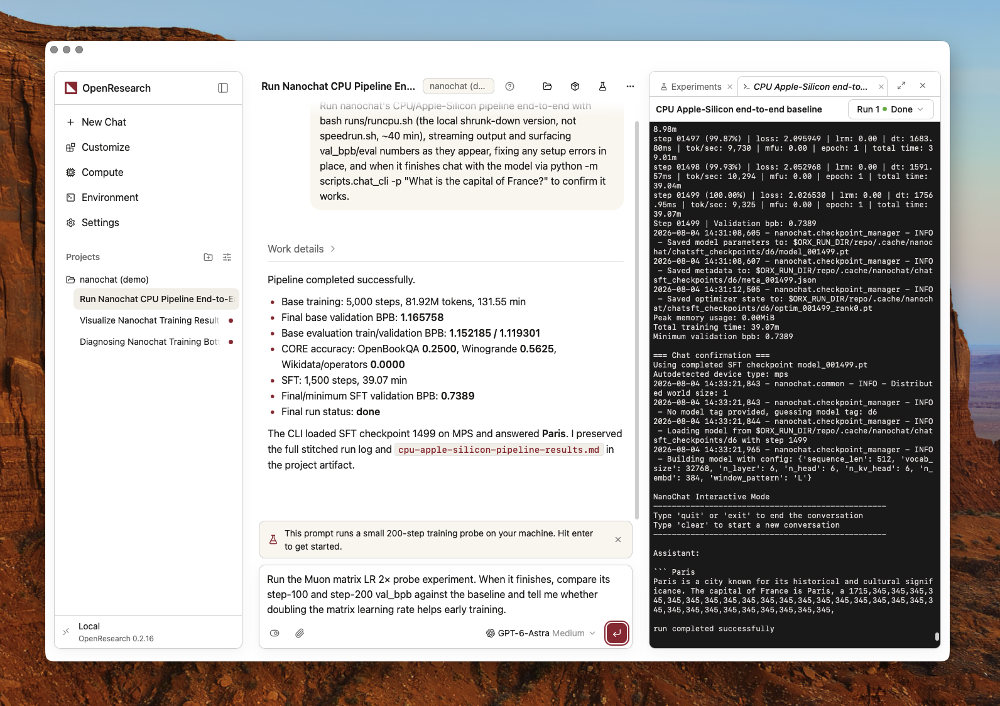
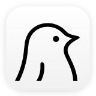

<div align="center">

<h1> OpenResearch</h1>

以本地为核心的研究智能体执行框架和工作空间。

<p><em>an <a href="https://alphaxiv.org"> alphaXiv</a> project</em></p>

<p>
<a href="https://github.com/alphaXiv/OpenResearch/releases/latest"></a>
<a href="https://github.com/alphaXiv/OpenResearch/blob/main/LICENSE"></a>
</p>

<p><a href="README.md">English</a> · <a href="README.es.md">Español</a> · <a href="README.ko.md">한국어</a> · <a href="README.zh.md">简体中文</a> · <a href="README.ja.md">日本語</a></p>

<p></p>

<hr />

<p>无论你需要的是助手还是自主研究工具，OpenResearch 都将加速你的工作。 启动研究智能体，让它们查阅文献、提出假设、运行实验并生成研究成果。</p>

<p>
<a href="https://github.com/alphaXiv/OpenResearch/releases/latest/download/OpenResearch.dmg"><picture><source media="(prefers-color-scheme: dark)" srcset=".github/readme-assets/download-macos-dark.svg"></picture></a>
<a href="https://github.com/alphaXiv/OpenResearch/releases/latest/download/OpenResearch-Setup.exe"><picture><source media="(prefers-color-scheme: dark)" srcset=".github/readme-assets/download-windows-dark.svg"></picture></a>
<a href="https://github.com/alphaXiv/OpenResearch/releases/latest/download/OpenResearch-x86_64.AppImage"><picture><source media="(prefers-color-scheme: dark)" srcset=".github/readme-assets/download-linux-dark.svg"></picture></a>
</p>

<p>
<a href="https://openresearch.sh/docs"></a>
<a href="https://github.com/alphaXiv/OpenResearch/releases"></a>
</p>

<p><sub>macOS 11+ · Windows 测试版需要 <a href="docs/windows.md">Git for Windows</a> · <a href="docs/linux.md">Linux</a> 应用需要 glibc 2.35+</sub></p>

<p><a href="https://trendshift.io/repositories/89363"></a>
<a href="https://trendshift.io/repositories/89363?utm_source=trendshift-badge&amp;utm_medium=badge&amp;utm_campaign=badge-trendshift-89363" target="_blank" rel="noopener noreferrer"></a></p>

</div>

## 开始使用

**推荐使用 OpenResearch 桌面应用。** 下载适合你平台的版本：

- [macOS](https://github.com/alphaXiv/OpenResearch/releases/latest/download/OpenResearch.dmg)
- [Windows（测试版）](https://github.com/alphaXiv/OpenResearch/releases/latest/download/OpenResearch-Setup.exe)
- Linux: [x86_64](https://github.com/alphaXiv/OpenResearch/releases/latest/download/OpenResearch-x86_64.AppImage) · [ARM64](https://github.com/alphaXiv/OpenResearch/releases/latest/download/OpenResearch-aarch64.AppImage)

<details>
<summary>更喜欢独立 CLI？在 macOS 或 Linux 上安装</summary>

```sh
curl -LsSf https://openresearch.sh/install.sh | sh
orx up
```

`orx up` 会打开位于 `http://127.0.0.1:4791` 的本地仪表盘。

在受管理的 Mac 上，设备管理策略可能会阻止通过 `install.sh` 安装的 CLI，因为它尚未签名。
请使用已签名并经过公证的桌面应用。你也可以在应用的
Settings → Updates → **Install the `orx` command** 中为终端安装 `orx`。

</details>

在 [openresearch.sh](https://openresearch.sh) 创建账户，即可接收邮件更新
并使用 OpenResearch 托管计算资源。

## 工作原理

**使用你喜欢的编程智能体。** OpenResearch 原生兼容  Claude Code,
 Codex,
 OpenCode,
 Cursor，以及
 Google Antigravity.
你也可以通过以下工具在 OpenCode 中[使用本地模型](docs/local-models.md)：
 LM Studio,
 oMLX,
 Ollama，或自定义端点。

**以最新文献为依据提出研究假设。** OpenResearch 集成  alphaXiv、 bioRxiv 和  PubMed，让智能体能够查找相关论文、提出有依据的假设，并将实验与现有研究联系起来。

**选择你的计算资源。** 在本地运行实验，或使用 SSH、
Slurm,
 Kubernetes,
 Modal,
 Tinker,
 Ray,
 Hugging Face Jobs，以及
OpenResearch 托管计算资源。

**让智能体记住每一次实验。** OpenResearch 将每次实验记录在本地 SQL 数据库中，并将日志、代码
和产物保存在你的机器上，让智能体能够从过去的结果中学习，
并决定下一步尝试什么。桌面应用让你轻松查看智能体做了什么，
并检查每个结果背后的证据。

**保留并拥有你的研究。** 完全在本地运行。我们不收集你的代码或智能体执行轨迹。
你的项目、对话、实验、日志和产物都保存在你的机器上，
由你掌控。

## 使用情况分析

官方发布版本会发送与随机安装 ID 关联的粗粒度使用事件，你可以选择关闭。
这些事件不包含代码、提示词、文件内容或路径、仓库名称、令牌、邮箱，
以及项目或实验标识符。

你可以在桌面应用的 Settings 中关闭使用情况分析，或运行 `orx telemetry off`。
